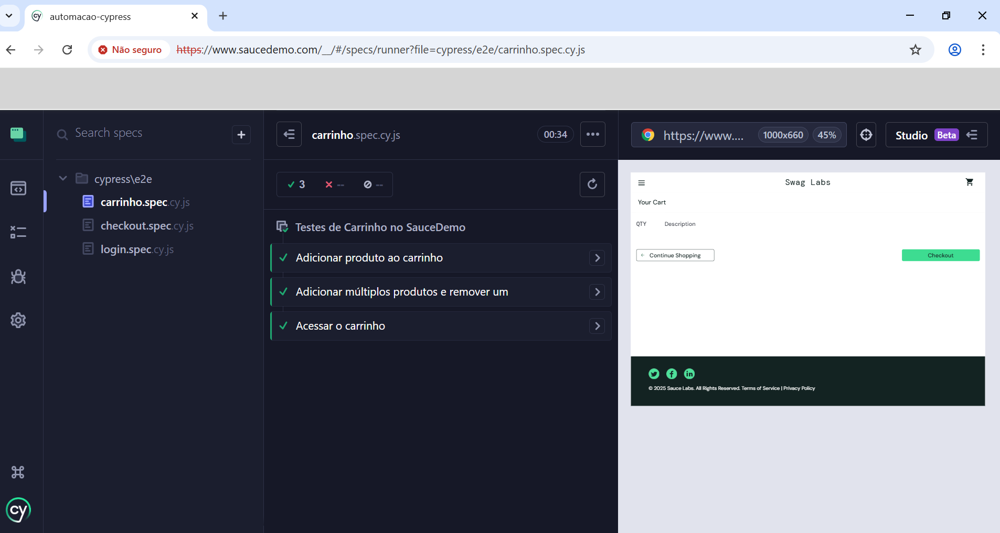
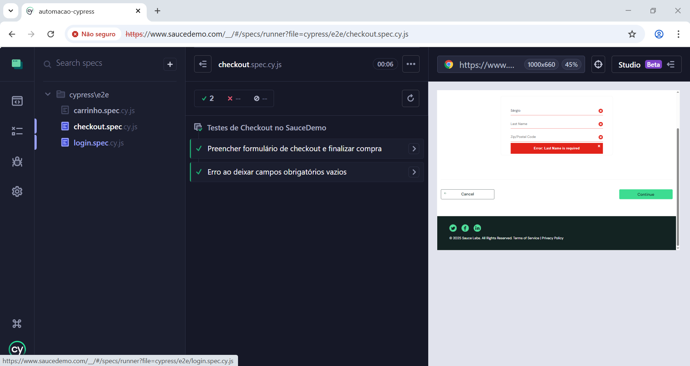

# Portfólio QA Júnior - Sérgio Jesus

Bem-vindo ao meu portfólio de Quality Assurance!  
Estou em formação como QA Júnior, com foco em **testes manuais**, **relatórios de bugs** e **automação de testes com Cypress**.  

Atualmente buscando oportunidades em Portugal (híbrido ou remoto).

### Habilidades e Ferramentas
- Testes Manuais: Planos de teste, casos de teste detalhados (Excel, Markdown), matriz de rastreabilidade.
- Relatórios de Bugs: Documentação profissional com passos para reproduzir, evidências visuais (screenshots anotados) e severidade.
- Automação de Testes: Cypress (E2E, 100% green) – login, carrinho, checkout no SauceDemo.
- Controle de Versão: Git & GitHub.
- Outras: Noções de Jira, Postman (API básico), uso de IA para gerar e otimizar scripts de teste.

### Projetos em Destaque
- **Testes Manuais** – Casos de teste detalhados no SauceDemo (Excel + Markdown):  
  [Ver pasta testes-manuais](./testes-manuais/)

- **Relatórios de Bugs** – 4 bugs reais reportados com tabela, passos, resultados e screenshots:  
  [Ver pasta relatorios-bugs](./relatorios-bugs/)

- **Automação com Cypress** – Testes E2E completos (login, carrinho, checkout – todos passando verde):  
  [Ver pasta automacao-cypress](./automacao-cypress/)

  ### Evidências Visuais – Automação Cypress
Todos os testes (login, carrinho e checkout) rodando 100% green no runner:

### Progresso e Atividade
- Dezembro 2025: Configuração completa de Cypress, testes rodando 100% green, limpeza de estrutura e documentação profissional.
- Compromisso: Atualizações regulares para adicionar novos testes e funcionalidades (ex: API testing, CI/CD).

### Contato
- LinkedIn: [linkedin.com/in/sergio-luiz-561868343](https://www.linkedin.com/in/sergio-luiz-561868343/)
- Email: sergido102@gmail.com
- Disponível para vagas QA Júnior em Portugal (híbrido em Porto/Leiria ou remoto).

Obrigado por visitar! Feedback é bem-vindo. 🚀
