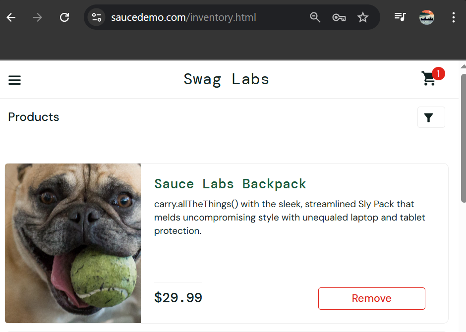
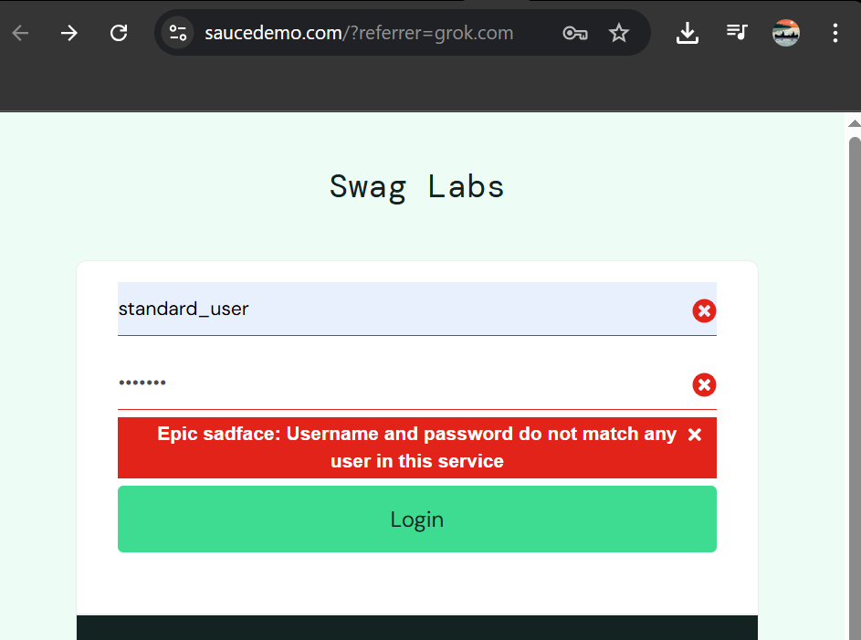
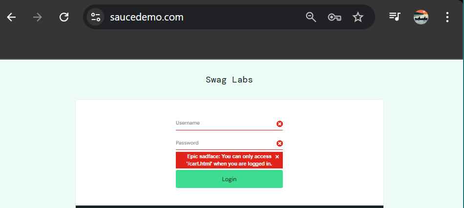
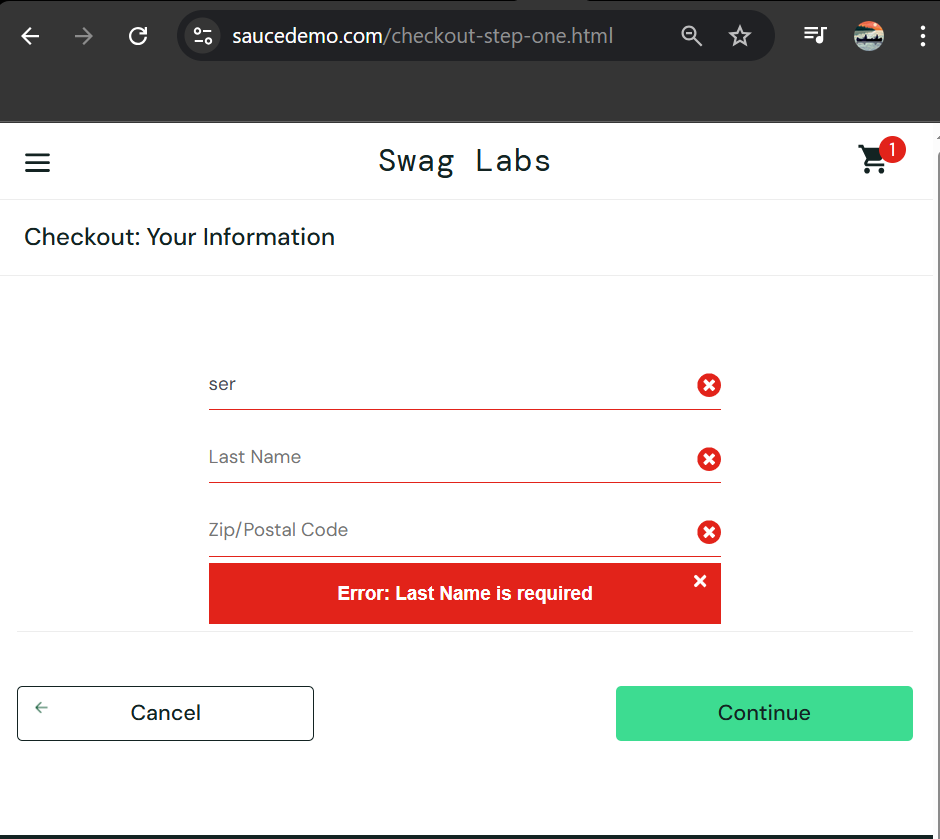

# Relatório de Bugs - SauceDemo

Bugs encontrados em testes manuais no https://www.saucedemo.com/.

| ID Bug | Título                              | Severidade | Passos para Reproduzir                          | Resultado Esperado                     | Resultado Atual                          | Evidência          |
|--------|-------------------------------------|------------|-------------------------------------------------|----------------------------------------|------------------------------------------|--------------------|
| BUG-001| Botão Add to cart não atualiza     | Alta      | 1. Adicionar produto 2. Remover do carrinho | Botão volta para "Add to cart"        | Contador não diminui                    | |
| BUG-002| Página do carrinho não abre        | Alta      | 1. Adicionar itens 2. Clicar no ícone carrinho | Abre página com produtos listados     | Usuário deslogado + erro de login       |   |
| BUG-003| Erro ao preencher campos checkout  | Alta      | Preencher First/Last Name e Zip                | Redireciona para overview             | Campo Last Name apaga First Name        | |
| BUG-004| Confirmação não abre               | Alta      | Clicar Finish após preenchimento               | Página "Thank you for your order"     | Erro por dados inválidos                | |
